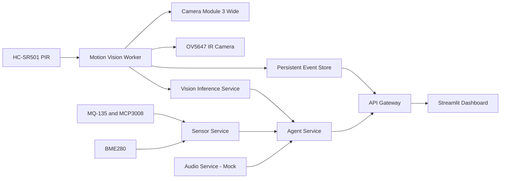

# EdgeSense-MA

**A multi-agent, multimodal edge-AI monitoring system running locally on Raspberry Pi 5**

EdgeSense-MA combines dual-camera vision, PIR-triggered event capture, environmental sensing, ONNX object detection, explainable risk assessment, persistent event storage, and a real-time Streamlit dashboard.

The complete stack runs locally on a Raspberry Pi 5 and is managed by systemd with automatic startup and crash recovery.

## Current project status

EdgeSense-MA is a working Raspberry Pi edge-AI deployment rather than a mock-only scaffold.

The current implementation includes:

- real RGB and infrared camera capture
- PIR-triggered dual-camera event acquisition
- YOLO11n ONNX inference on Raspberry Pi CPU
- real BME280 environmental readings
- real MQ-135 readings through MCP3008
- calibrated relative MQ-135 signal classification
- persistent event storage and retention
- event categorization and filtering
- rule-based multimodal risk assessment
- live worker and hardware telemetry
- Streamlit monitoring dashboard
- systemd startup, supervision, and crash recovery
- automated stack health checks

Audio hardware is not yet connected. The audio service currently operates in mock mode, and synthetic audio data is explicitly excluded from risk scoring.

## Hardware

The current deployment uses:

- Raspberry Pi 5, 8 GB
- Raspberry Pi Camera Module 3 Wide
- MakerHawk OV5647 infrared fisheye camera
- HC-SR501 PIR motion sensor on GPIO 23
- BME280 sensor at I2C address `0x77`
- AZDelivery MQ-135 gas sensor module
- MCP3008 analog-to-digital converter on SPI
- 10K/10K voltage divider between MQ-135 AO and MCP3008 CH0
- active Raspberry Pi cooling
- Waveshare 10.1-inch touch display

Available but not yet integrated:

- Raspberry Pi AI HAT+ 2
- Waveshare WM8960 Audio HAT
- ADS1115 ADC

## Architecture



## PIR-triggered capture pipeline

Both cameras remain closed while the system is idle.

When PIR motion is detected:

1. The RGB camera is opened.
2. Three RGB frames are captured.
3. The sharpest frame is selected.
4. The RGB camera is closed.
5. The infrared camera is opened.
6. An infrared evidence image is captured.
7. The infrared camera is closed.
8. YOLO11n ONNX inference runs on the selected RGB frame.
9. Sensor and audio metadata are collected.
10. The Agent Service produces an explainable risk decision.
11. Raw, annotated, infrared, and JSON evidence is saved.

When motion is detected but no accepted object is found, the event is classified as `unknown_motion` rather than silently discarded.

## Event categories

Stored motion events can be classified as:

- `person`
- `animal`
- `vehicle`
- `carried_object`
- `general_object`
- `unknown_motion`

The API and dashboard support category filtering.

## MQ-135 signal processing

The MQ-135 analog output is read from MCP3008 channel 0.

EdgeSense-MA preserves the raw ADC reading but does not present it as regulatory AQI, carbon-dioxide concentration, or calibrated gas-specific ppm.

Classification uses a device-specific relative signal model with:

- a measured baseline
- rolling-median smoothing
- response ratios relative to the baseline
- conservative minimum raw thresholds
- confirmation across multiple samples
- hysteresis for stable state transitions

Current Raspberry Pi parameters:

| Parameter | Value |
|---|---:|
| Baseline raw value | 14 |
| Warning ratio | 1.8 |
| Critical ratio | 3.0 |
| Minimum warning threshold | 25 |
| Minimum critical threshold | 45 |
| Rolling window | 5 samples |
| Transition confirmation | 3 samples |

The resulting states are:

- `normal`
- `warning`
- `critical`

These states describe the relative response of this specific sensor installation. They are not medical, safety-certified, or regulatory air-quality classifications.

## Vision inference

The Vision Inference Service uses:

- YOLO11n
- ONNX Runtime
- CPU inference on Raspberry Pi 5
- configurable confidence and NMS thresholds
- frame-quality analysis
- blur detection
- dark-frame and overexposure detection
- high-priority and contextual object filtering

The ONNX model is expected at:

```text
models/onnx/yolo11n.onnx
```

The calibrated blur threshold for the current camera pipeline is `4.7`.

Typical YOLO11n ONNX inference latency on the current Raspberry Pi CPU is approximately 145 to 300 milliseconds, depending on system load and image content.

## Risk assessment

The Agent Service currently uses deterministic and explainable rules.

Its inputs can include:

- accepted object detections
- event classification
- frame-quality metadata
- temperature
- humidity
- pressure
- MQ-135 relative signal level
- audio metadata

Audio hardware is not connected in the current deployment. Therefore:

- `source_mode` is `mock`
- `hardware_ready` is `false`
- `trusted_for_risk` is `false`
- synthetic audio contributes zero risk

The decision output includes a risk level and human-readable reasons.

Current risk levels:

- `LOW`
- `MEDIUM`
- `HIGH`
- `UNKNOWN`

## Services and ports

| Component | Port | Purpose |
|---|---:|---|
| API Gateway | 8000 | Unified API and event access |
| Camera Service | 8001 | Camera status and snapshots |
| Sensor Service | 8002 | BME280 and MQ-135 readings |
| Audio Service | 8003 | Audio metadata and readiness |
| Vision Inference Service | 8004 | YOLO11n ONNX detection |
| Agent Service | 8005 | Explainable multimodal decisions |
| Streamlit Dashboard | 8501 | Monitoring and event interface |
| Motion Vision Worker | N/A | PIR-triggered capture pipeline |

The FastAPI services use the project virtual environment. The Motion Vision Worker uses Raspberry Pi OS system Python because Picamera2 is installed there.

## API overview

### API Gateway

- `GET /health`
- `GET /system/status`
- `GET /system/snapshot`
- `GET /system/live`
- `GET /system/worker-status`
- `POST /system/analyze-live`
- `POST /system/analyze`
- `GET /agents/demo/{scenario}`
- `GET /events`
- `GET /events/latest`
- `GET /events/{event_id}`
- `GET /events/{event_id}/image`
- `GET /reports/latest`
- `GET /reports/history`

The events endpoint supports filtering by event category.

### Camera Service

- `GET /camera/status`
- `POST /camera/snapshot`

### Sensor Service

- `GET /sensors/status`
- `GET /sensors/current`

### Audio Service

- `GET /audio/status`
- `GET /audio/latest`

### Vision Inference Service

- `GET /vision/status`
- `POST /vision/detect`
- `GET /vision/latest`
- `POST /vision/reset`
- `GET /vision/benchmark`

### Agent Service

- `GET /agents/status`
- `POST /agents/analyze`
- `GET /agents/demo/{scenario}`

Interactive FastAPI documentation is exposed through `/docs` on each service port.

## Raspberry Pi deployment

The production Raspberry Pi stack is managed by systemd.

Installed units:

```text
edgesense-camera.service
edgesense-sensor.service
edgesense-audio.service
edgesense-vision.service
edgesense-agent.service
edgesense-api.service
edgesense-motion-worker.service
edgesense-dashboard.service
edgesense-ma.target
```

The complete stack starts automatically after boot.

Common management commands:

```bash
sudo systemctl start edgesense-ma.target
sudo systemctl stop edgesense-ma.target
sudo systemctl restart edgesense-ma.target
systemctl status edgesense-ma.target
```

Inspect service logs with:

```bash
journalctl -u edgesense-sensor.service
journalctl -u edgesense-motion-worker.service
journalctl -u edgesense-dashboard.service
```

The deployment definitions are stored under:

```text
deploy/systemd/
```

Services use `Restart=on-failure`, allowing systemd to recover them automatically after unexpected termination.

## Health check

Run the complete Raspberry Pi stack health check with:

```bash
./scripts/check_pi_stack.sh
```

The health check verifies:

- systemd target state
- all EdgeSense service states
- ports 8000 through 8005
- dashboard port 8501
- API Gateway health
- current sensor response
- Streamlit dashboard health
- motion-worker heartbeat
- PIR availability
- failed EdgeSense units
- Git working-tree state

A fully operational deployment ends with:

```text
HEALTHY: all EdgeSense-MA checks passed
```

## Dashboard

The Streamlit dashboard is available locally at:

```text
http://127.0.0.1:8501
```

For remote access through an SSH tunnel:

```bash
ssh -N -L 8502:127.0.0.1:8501 YOUR_USER@RASPBERRY_PI_IP
```

Then open:

```text
http://127.0.0.1:8502
```

The dashboard displays:

- service and worker health
- PIR state and trigger count
- camera capture state and latency
- BME280 environmental readings
- MQ-135 relative response state
- latest object detections
- event categories and timeline
- saved RGB, annotated, and infrared evidence
- multimodal risk decisions
- explicit audio hardware readiness status

## Manual Raspberry Pi startup

Manual startup scripts remain available for development and troubleshooting:

```bash
./scripts/run_pi_services.sh
./scripts/run_pi_dashboard.sh
./scripts/stop_pi_services.sh
```

Do not run the manual service scripts while the systemd deployment is active because both methods use the same ports.

## Testing

Run the software test suite with:

```bash
python -m pytest -q
```

Hardware-specific tests are separated under:

```text
hardware_tests/
```

Picamera2 is provided by Raspberry Pi OS and is accessed through `/usr/bin/python3` rather than the project virtual environment.

## Repository structure

```text
dashboard/                  Streamlit monitoring interface
deploy/systemd/             Raspberry Pi systemd deployment
docs/                       Technical documentation
hardware_tests/             Hardware-specific validation
models/onnx/                ONNX vision model
scripts/                    Startup, worker, calibration, and health tools
services/                   FastAPI microservices
shared/                     Shared schemas, event store, and decision logic
tests/                      Software unit tests
data/events/                Persisted event evidence
data/runtime/               Worker heartbeat and runtime metadata
data/calibration/           Local sensor calibration results
```

## Current limitations

- Audio hardware is not connected.
- Audio input is mock-only and excluded from risk scoring.
- MQ-135 output represents relative sensor response, not regulatory AQI or gas-specific ppm.
- Raspberry Pi AI HAT+ 2 acceleration is not yet integrated.
- The Agent Service currently uses rule-based reasoning rather than a local language model.
- Benchmark results are documented in `docs/benchmark_results.md`.
- The project is released under the MIT License.

## Documentation

Additional technical material is stored under `docs/`:

- `architecture.md`
- `hardware_setup.md`
- `api_reference.md`
- `demo_scenarios.md`
- `benchmark_results.md`
- `interview_notes.md`
- `knowledge_base/`

Some older documents are being updated to match the current Raspberry Pi implementation.

## License

This project is licensed under the MIT License. See [`LICENSE`](LICENSE) for details.

## Project objective

EdgeSense-MA demonstrates the complete engineering path from physical sensors to a resilient local edge-AI application:

- hardware integration
- edge computer vision
- multimodal data fusion
- explainable decision logic
- persistent evidence storage
- operational monitoring
- automated startup
- crash recovery
- testable microservice architecture
