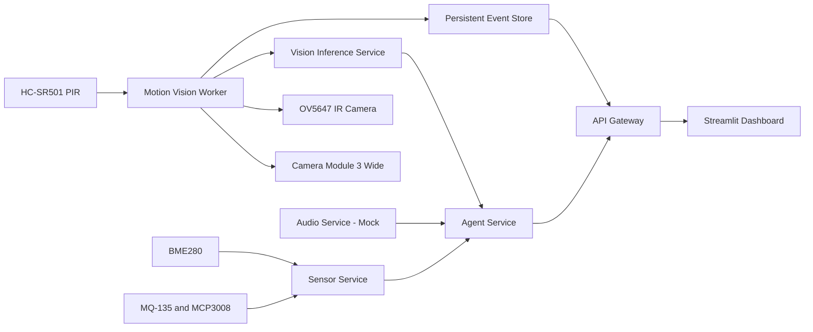

# Architecture

EdgeSense-MA is a modular multimodal edge-AI system running locally on Raspberry Pi 5.

The architecture separates hardware access, inference, reasoning, persistence, APIs, and presentation into independently supervised components.

## System overview

## Runtime components

| Component | Responsibility | Port | Runtime |
|---|---|---:|---|
| Camera Service | Camera status and manual snapshots | 8001 | Project virtual environment |
| Sensor Service | BME280 and MQ-135 acquisition and classification | 8002 | Project virtual environment |
| Audio Service | Audio metadata and hardware readiness | 8003 | Project virtual environment |
| Vision Inference Service | YOLO11n ONNX object detection | 8004 | Project virtual environment |
| Agent Service | Explainable multimodal risk decisions | 8005 | Project virtual environment |
| API Gateway | Unified API, reports, live state, and event access | 8000 | Project virtual environment |
| Motion Vision Worker | PIR-triggered RGB and IR capture pipeline | N/A | Raspberry Pi OS system Python |
| Streamlit Dashboard | Local monitoring and event interface | 8501 | Project virtual environment |

## Event acquisition flow

The Motion Vision Worker is responsible for event-driven capture.

1. The worker monitors the HC-SR501 PIR sensor on GPIO 23.
2. Both cameras remain closed while the system is idle.
3. A PIR rising edge starts an event capture.
4. Camera Module 3 Wide captures three RGB frames.
5. The sharpest RGB frame is selected.
6. The RGB camera is closed.
7. The OV5647 infrared camera captures supporting evidence.
8. The infrared camera is closed.
9. The selected RGB image is sent to the Vision Inference Service.
10. Current sensor and audio metadata are collected.
11. The Agent Service produces an explainable decision.
12. Images, metadata, detections, classification, and decision data are persisted.

This strategy avoids keeping both camera devices open continuously and reduces camera-resource conflicts.

## Vision pipeline

The Vision Inference Service runs YOLO11n in ONNX Runtime on Raspberry Pi CPU.

The pipeline includes:

- image decoding and preprocessing
- ONNX inference
- confidence filtering
- non-maximum suppression
- relevant-class filtering
- frame-quality analysis
- annotated-image generation
- inference latency reporting

The current calibrated blur threshold is `4.7`.

A PIR event with no accepted detection is stored as `unknown_motion` instead of being discarded.

## Sensor pipeline

The Sensor Service reads:

- temperature, humidity, and pressure from BME280 over I2C
- MQ-135 analog response from MCP3008 channel 0 over SPI

MQ-135 processing uses a stateful relative signal classifier with:

- baseline value `14`
- rolling-median window of `5` samples
- warning ratio `1.8`
- critical ratio `3.0`
- minimum warning threshold `25`
- minimum critical threshold `45`
- three-sample transition confirmation
- warning and critical hysteresis

The MQ-135 values are treated as device-specific relative response levels, not regulatory AQI or gas-specific ppm.

## Audio trust boundary

The Audio Service currently operates in mock mode because the physical audio hardware is not connected.

Its status explicitly reports:

- `source_mode=mock`
- `hardware_ready=false`
- `trusted_for_risk=false`

Synthetic audio metadata is available for interface testing but contributes zero risk.

## Reasoning layer

The Agent Service currently uses deterministic, explainable rules rather than a local language model.

The decision process can use:

- accepted detections
- event category
- image-quality metadata
- BME280 readings
- MQ-135 relative signal state
- trusted audio metadata

The output contains a final risk level and human-readable reasons.

## Event persistence

Events are stored under `data/events/` and may include:

- raw RGB image
- annotated RGB image
- infrared image
- object detections
- event classification
- sensor snapshot
- audio metadata
- agent decision
- capture and inference timings

Retention is controlled by maximum event count and age-based cleanup settings.

## Operational supervision

The production stack is managed by systemd.

Each long-running component has its own unit and uses automatic restart on failure.

The `edgesense-ma.target` groups the complete application stack and is enabled for automatic startup after boot.

The health-check script verifies service states, listening ports, APIs, dashboard health, worker heartbeat, PIR availability, failed units, and Git status.

## Design principles

- one service per primary responsibility
- local-first processing and evidence storage
- explicit separation of real and mock data
- explainable decisions instead of hidden scoring
- event-driven camera use
- hardware-aware Python runtime selection
- independently restartable services
- observable runtime state
- conservative sensor interpretation
- testable shared logic
